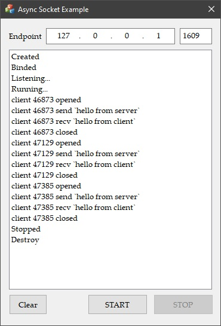

### Async Socket Example MFC ###

This is an example for Asynchronous Socket Server in MFC application

---

#### Installation ####

> Depends on **Async Socket** in [https://github.com/vic4key/Vutils](https://github.com/vic4key/Vutils)

#### Screenshots ####

---

Website: https://vic.onl/